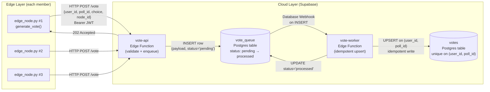

# Distributed Voting System (CS323 LabAct-2)

## Group Members

- Tion, James Dominic P.
- Olaer, Kurt Andre L.
- Gimolatan, Brandon Ian A.
- Gicole, Aldrick James A.
- Abulkhair, Johanie A.

## System Overview

An event-driven edge-to-cloud voting pipeline. Synthetic edge nodes generate votes and send them over HTTP to a serverless ingestion function, which enqueues the payload. A worker function asynchronously processes queued rows and writes idempotent results to a final `votes` table.

> **Note:** Implemented on **Supabase** as an approved alternative to GCP (the GCP free tier now requires billing details). The architecture preserves the lab's intent — HTTP ingestion, asynchronous queue, worker processing, persistent storage — only the providers differ.

## Architecture Diagram



### Data flow summary

1. Multiple edge nodes generate vote payloads `{user_id, poll_id, choice, node_id}` and POST them to `vote-api` with the anon JWT.
2. `vote-api` validates the payload, inserts a row into `vote_queue` with `status='pending'`, and returns `202 Accepted` immediately (non-blocking ingestion).
3. A Database Webhook on `vote_queue` fires on every `INSERT`, invoking `vote-worker` asynchronously (Pub/Sub-equivalent decoupling).
4. `vote-worker` upserts into `votes` using `(user_id, poll_id)` as the conflict key — duplicate deliveries collapse to one row (idempotency) — then marks the queue row `processed`.

### Mapping to the lab handout (GCP → Supabase)

| Lab component (GCP)               | This implementation (Supabase)        |
| --------------------------------- | ------------------------------------- |
| Cloud Run API                     | `vote-api` Edge Function              |
| Pub/Sub topic + pull subscription | `vote_queue` table + Database Webhook |
| Cloud Run worker                  | `vote-worker` Edge Function           |
| Firestore `votes`                 | Postgres `votes` table                |

## Repository Layout

- `edge_node.py` - continuous edge simulator (retries, random delay).
- `fault_injection.py` - duplicate delivery and fault scenario runner.
- `supabase/functions/vote-api/` - ingestion Edge Function.
- `supabase/functions/vote-worker/` - processing Edge Function.
- `requirements.txt` - Python dependencies.

## Prerequisites

- Python 3.x with `pip`
- A Supabase project (free tier is sufficient)
- *(Optional)* Supabase CLI for deploying functions from the terminal

## Setup and Execution

### 1. Cloud setup (Supabase)

1. Created a Supabase project.
2. In the SQL editor, created the tables used by the system:

   ```sql
   create table if not exists public.vote_queue (
     id          bigint generated by default as identity primary key,
     payload     jsonb not null,
     status      text default 'pending',
     created_at  timestamptz default now()
   );

   create table if not exists public.votes (
     id          uuid primary key default gen_random_uuid(),
     user_id     text not null,
     poll_id     text not null,
     choice      text not null,
     metadata    jsonb,
     created_at  timestamptz default now(),
     unique (user_id, poll_id)
   );

   create table if not exists public.system_metrics (
     id                bigint generated by default as identity primary key,
     user_id           text,
     edge_timestamp    float8,
     worker_timestamp  float8,
     final_timestamp   timestamptz,
     latency_seconds   float8,
     status            text,
     created_at        timestamptz default now()
   );
   ```

3. Deployed both Edge Functions: `vote-api` and `vote-worker` (via Dashboard).

4. Set the Edge Function **secrets** so the worker can write back to Postgres (Dashboard → Edge Functions → Secrets, or `supabase secrets set`):

    - `SUPABASE_URL` — project URL  
    - `SUPABASE_SERVICE_ROLE_KEY` — service-role JWT (**Project Settings → API**)

5. Configured a **Database Webhook** on `public.vote_queue`:

    - Event: `INSERT`
    - HTTP method: `POST`
    - URL: deployed `vote-worker` endpoint (`https://<ourproject-ref>.supabase.co/functions/v1/vote-worker`)
    - Headers: `Authorization: Bearer <SUPABASE_SERVICE_ROLE_KEY>`, `Content-Type: application/json`
    - Payload sends the inserted row as `record`, which the worker reads as `record.payload`.

### 2. Local client setup

```bash
cd LabAct-2
pip install -r requirements.txt
```

The `.env` file (gitignored) only needs two variables, both pulled from **Project Settings → API**:

```dotenv
SUPABASE_URL=
SUPABASE_ANON_KEY=
```

### 3. Run the system

```bash
python edge_node.py          # continuous vote generation
python fault_injection.py    # duplicate / failure scenarios
```

Can be stopped with **Ctrl+C**. Watch `vote_queue` and `votes` in Supabase Studio to confirm flow.

## Fault Scenarios

`fault_injection.py` provides an interactive prompt with two modes mapped to the lab's fault-injection part:

| Mode                        | What it does                                                             | Expected behavior                                                                                                                                                          |
| --------------------------- | ------------------------------------------------------------------------ | -------------------------------------------------------------------------------------------------------------------------------------------------------------------------- |
| **1. Duplication test**     | Sends the same vote 3 times in succession.                               | `vote_queue` gets 3 rows; `votes` ends up with **1** row (idempotent upsert on `(user_id, poll_id)`).                                                                      |
| **2. Continuous + failure** | Streams votes continuously while you toggle the Database Webhook off/on. | While webhook is **off**: `vote_queue` grows with `pending` rows, `votes` is unchanged. After turning it back **on**: queued rows drain automatically, `votes` catches up. |

The three execution states to demonstrate (per Lab Part 5):

1. **Normal** - all components active, votes flow edge → queue → votes with low delay.
2. **Worker failure** - webhook disabled; ingestion still returns 202, queue accumulates, `votes` stalls.
3. **Recovery** - webhook re-enabled; backlog drains without manual replay.

## Evaluation Observations

Approximate values observed during testing with 5 concurrent edge nodes (each sleeping 1–3 s between sends). Raw latency samples are recorded in the `system_metrics` table.

| Metric                    | Normal                 | Worker disabled       | Recovery                       |
| ------------------------- | ---------------------- | --------------------- | ------------------------------ |
| End-to-end latency        | ~0.8 – 1.5 s           | n/a (not processed)   | ~1.5 – 3.0 s during drain      |
| Throughput                | ~120 – 150 votes / min | 0 processed / min     | brief spike (~200 – 300 / min) |
| Queue depth (`pending`)   | ~0 – 5 rows            | grows ~150 rows / min | drops to ~0 within seconds     |
| Lost votes                | 0                      | 0 (buffered in queue) | 0 (eventual write)             |
| Duplicate rows in `votes` | 0                      | 0                     | 0                              |

> Latency rises briefly during recovery because the worker processes the backlog in rapid succession; once drained, it returns to baseline. Edge Function cold-starts can occasionally push the first sample after an idle period to ~3 s.

**Trade-offs observed:**

- Async webhook delivery improves availability but adds a small ingestion-to-storage delay.
- Edge Function cold-starts add latency to the first vote after idle periods.
- Idempotent upserts add a small write cost but guarantee a consistent final state under duplicate or retried delivery.
- Postgres-as-queue (vs. real Pub/Sub) is simpler to operate but throughput is bounded by row-insert rate.

## Deployed Endpoint

`https://qzzlokyafffzqmnphsfb.supabase.co/functions/v1/vote-api`

## Demo

Short GIF/video link attached in the submission on Google Classroom.

---

## Reflections

**Member 1: Tion, James Dominic P.**

Implementing this voting system provided a clear contrast between sequential and distributed execution. In a sequential program, a failure in the database would immediately crash the client. However, in our distributed setup, I observed Fault Isolation in action: when I intentionally disabled the worker (simulating a backend failure by toggling the Supabase Webhook), the edge_node.py continued to receive successful 200 OK responses. This highlighted the power of Temporal Decoupling, the system didn't stop, it simply buffered the data in the vote_queue. This experience solidified my understanding that availability and processing can be separated to create a more resilient architecture.

**Member 2: Olaer, Kurt Andre L.**

Our Supabase setup made the lab's architecture feel real: edge nodes send votes over HTTP, vote-api enqueues them in vote_queue, and vote-worker processes them asynchronously. That separation showed me why distributed systems use buffers ingestion can stay available even when processing lags. Sending duplicate votes highlighted idempotency: the final votes rows should stay consistent and not multiply when the same payload is delivered more than once. Temporarily disabling the webhook simulated a failed worker; the queue backed up while edges kept sending, and turning the worker back on drained pending work. Compared to a single-threaded program, debugging was harder because I had to correlate logs and table state, but I also saw clearer fault isolation and recovery behavior.

**Member 3: Gimolatan, Brandon Ian A.**

During the implementation and testing of the distributed voting system on Google Cloud Platform, I observed major differences between sequential and distributed execution. In the sequential setup, processing was simpler and easier to debug, while the distributed system allowed multiple edge nodes to send votes simultaneously through Cloud Run, Pub/Sub, the worker service, and Firestore. As the number of votes increased, Pub/Sub buffered messages to handle the load, while Firestore showed slight delays due to eventual consistency. One of the main challenges was configuring and connecting the different GCP services, especially during deployment and debugging. Although distributed execution improved scalability and processing throughput, it also introduced communication overhead, synchronization delays, and more complex debugging. Overall, the activity helped me better understand the advantages and challenges of distributed systems in real-world cloud environments.

**Member 4: Gicole, Aldrick James A.**

During testing distributed voting system gave me a understanding how real-world cloud architectures handle reliability and how distributed architectures improve reliability and scalability compared to sequential systems. What stood out most to me was how the system kept working even when parts of it failed. I observed that even when the worker service was temporarily unavailable, the edge nodes were still able to send votes successfully because the queue stored the pending requests. I also learned the importance of idempotency since duplicate vote requests did not create duplicate records in the final votes table. Overall, this activity made me realize how hard this is.

**Member 5: Abulkhair, Johanie A.**

Working on our distributed voting system project helped me better appreciate how modern applications are designed to stay reliable even when some parts of the system fail. Seeing our edge nodes, API, queue, and worker work together showed how distributed systems can continue functioning without completely stopping. The project also made me realize that building cloud-based applications involves more than just coding, since proper coordination between services is important for maintaining performance and reliability. Overall, the activity gave me a better understanding of how distributed architectures are used in real-world systems to support scalability and continuous operation.

